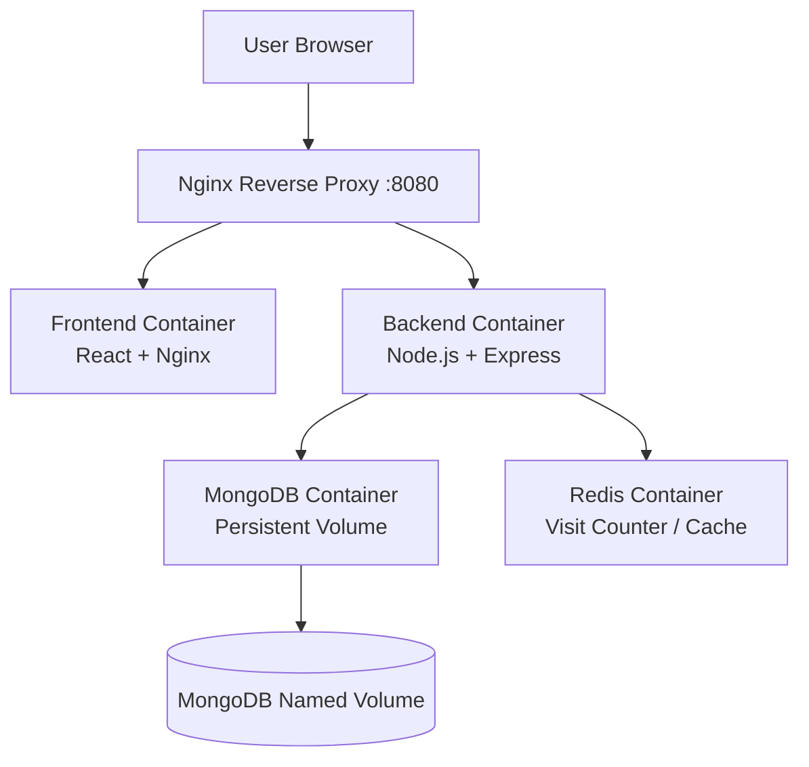
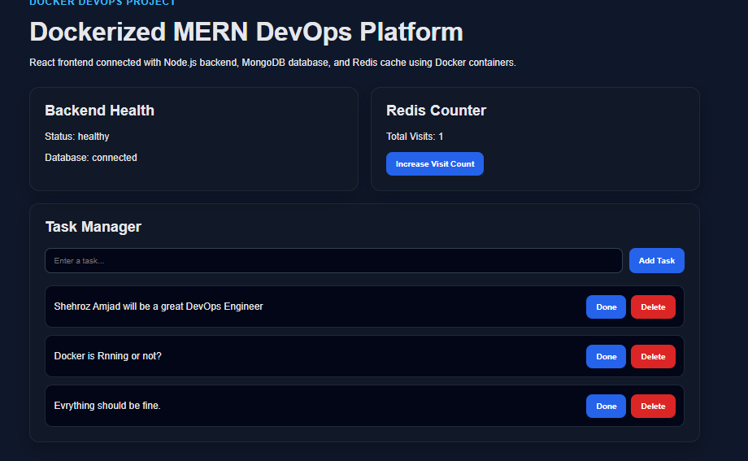
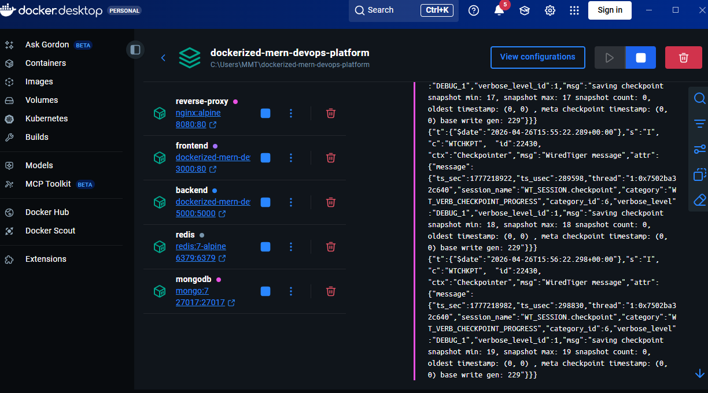
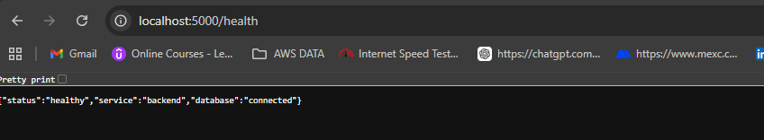

# Dockerized MERN DevOps Platform

A production-style full-stack MERN application containerized using **Docker**, **Docker Compose**, **MongoDB**, **Redis**, and **Nginx Reverse Proxy**.

This project demonstrates how a real-world multi-container application can be designed, containerized, networked, and served through a single entry point using Docker-based DevOps practices.

---

## Project Overview

This project is a Dockerized 3-tier task management application.

It includes:

- A React frontend
- A Node.js / Express backend API
- MongoDB for persistent task storage
- Redis for fast in-memory visit counting
- Nginx as a frontend web server
- Nginx as a reverse proxy
- Docker Compose for running the complete stack

The main purpose of this project is to demonstrate practical Docker and DevOps concepts such as containerization, multi-stage builds, service networking, persistent volumes, reverse proxy routing, and multi-container orchestration.

---

## Architecture



---

## Application Flow

```text
User opens http://localhost:8080
        |
        v
Nginx Reverse Proxy
        |
        |---- /          -> Frontend Container
        |---- /api/*     -> Backend Container
        |---- /health    -> Backend Container
                          |
                          |---- MongoDB Container
                          |---- Redis Container
```

---

## Tech Stack

| Category | Technology |
|---|---|
| Frontend | React, Vite |
| Backend | Node.js, Express.js |
| Database | MongoDB |
| Cache | Redis |
| Web Server | Nginx |
| Reverse Proxy | Nginx |
| Containerization | Docker |
| Orchestration | Docker Compose |
| Networking | Docker Bridge Network |
| Storage | Docker Named Volume |

---

## DevOps Concepts Demonstrated

- Dockerfile creation
- Multi-stage Docker builds
- Docker Compose orchestration
- Custom Docker bridge network
- Container-to-container communication
- Named volumes for persistent data
- Nginx reverse proxy configuration
- React production build served through Nginx
- Backend API containerization
- MongoDB and Redis service containers
- Environment-based service configuration
- Container logs and troubleshooting
- Single entry point application routing

---

## Features

### Application Features

- Create tasks
- View saved tasks
- Mark tasks as completed
- Undo completed tasks
- Delete tasks
- View backend health status
- View MongoDB connection status
- Track visits using Redis counter

### DevOps Features

- Frontend containerized with a multi-stage Docker build
- Backend containerized with Node.js Alpine image
- MongoDB data persistence using Docker volume
- Redis container used as a caching layer
- Nginx reverse proxy for single entry point
- Docker Compose for complete stack management
- Custom Docker network for internal service communication

---

## Services

| Service | Container Name | Port | Description |
|---|---|---|---|
| Reverse Proxy | `devops-reverse-proxy` | `8080:80` | Main application entry point |
| Frontend | `devops-frontend` | `3000:80` | React app served by Nginx |
| Backend | `devops-backend` | `5000:5000` | Express API server |
| MongoDB | `devops-mongodb` | `27017:27017` | Database container |
| Redis | `devops-redis` | `6379:6379` | Cache / visit counter |

---

## Final Application URL

Use this URL to access the complete application:

```text
http://localhost:8080
```

This URL goes through the Nginx reverse proxy and connects the frontend, backend, MongoDB, and Redis services together.

---

## Useful Local URLs

| URL | Purpose |
|---|---|
| `http://localhost:8080` | Final app through reverse proxy |
| `http://localhost:3000` | Direct frontend container |
| `http://localhost:5000` | Backend root API |
| `http://localhost:5000/health` | Backend health check |
| `http://localhost:5000/api/visits` | Redis visit counter |
| `http://localhost:5000/api/tasks` | Task API |

> Note: The complete application should be tested through `http://localhost:8080` because the reverse proxy routes frontend and backend requests correctly.

---

## Folder Structure

```text
dockerized-mern-devops-platform/
│
├── backend/
│   ├── src/
│   │   └── server.js
│   ├── Dockerfile
│   ├── .dockerignore
│   ├── .env.example
│   └── package.json
│
├── frontend/
│   ├── src/
│   │   ├── App.jsx
│   │   ├── App.css
│   │   └── main.jsx
│   ├── Dockerfile
│   ├── nginx.conf
│   ├── .dockerignore
│   ├── index.html
│   ├── package-lock.json
│   └── package.json
│
├── nginx/
│   └── default.conf
│
├── docs/
│   └── screenshots/
│       ├── app-dashboard.png
│       ├── docker-containers.png
│       └── api-health.png
│
├── docker-compose.yml
├── docker-compose.prod.yml
├── .gitignore
├── .env.example
└── README.md
```

---

## Screenshots

### Application Dashboard



### Running Docker Containers



### Backend Health Check



---

## Prerequisites

Before running this project, make sure the following tools are installed:

- Docker
- Docker Compose
- Git

Check Docker installation:

```bash
docker --version
docker compose version
```

---

## Getting Started

### 1. Clone the Repository

```bash
git clone https://github.com/Shehroz33/Dockerized-Mern-Devops-Platform.git
cd Dockerized-Mern-Devops-Platform
```

### 2. Start the Complete Application

```bash
docker compose up -d --build
```

This command will:

```text
1. Build the backend Docker image
2. Build the frontend Docker image
3. Pull MongoDB image
4. Pull Redis image
5. Pull Nginx image
6. Create a Docker network
7. Create MongoDB persistent volume
8. Start all containers
```

### 3. Verify Running Containers

```bash
docker ps
```

Expected containers:

```text
devops-reverse-proxy
devops-frontend
devops-backend
devops-mongodb
devops-redis
```

### 4. Open the Application

```text
http://localhost:8080
```

---

## Stop the Application

Stop all containers:

```bash
docker compose down
```

Stop containers and remove MongoDB volume:

```bash
docker compose down -v
```

> Use `docker compose down -v` only when you want to delete MongoDB data as well.

---

## Docker Compose Services Explained

### Reverse Proxy Service

The reverse proxy is the main entry point of the application.

```text
localhost:8080 -> Nginx Reverse Proxy
```

It routes requests to the correct internal container.

```text
/        -> frontend
/api/    -> backend
/health  -> backend
```

### Frontend Service

The frontend uses a multi-stage Docker build.

First stage:

```text
Node.js builds the React app
```

Second stage:

```text
Nginx serves the production build
```

This is better than running the React development server in production.

### Backend Service

The backend is a Node.js / Express API container.

It handles:

- Task CRUD operations
- Health check endpoint
- Redis visit counter
- MongoDB connection

### MongoDB Service

MongoDB stores task data.

It uses a named Docker volume:

```text
mongodb_data
```

This keeps data safe even if the MongoDB container is restarted or recreated.

### Redis Service

Redis is used as a fast in-memory store for the visit counter.

Every time the visit counter endpoint is called, Redis increments the count.

---

## API Endpoints

| Method | Endpoint | Description |
|---|---|---|
| GET | `/` | Backend root route |
| GET | `/health` | Backend and database health check |
| GET | `/api/visits` | Redis visit counter |
| GET | `/api/tasks` | Get all tasks |
| POST | `/api/tasks` | Create a new task |
| PATCH | `/api/tasks/:id` | Update task status |
| DELETE | `/api/tasks/:id` | Delete a task |

---

## Example API Responses

### Health Check

```json
{
  "status": "healthy",
  "service": "backend",
  "database": "connected"
}
```

### Redis Visit Counter

```json
{
  "visits": 1
}
```

### Task Example

```json
{
  "_id": "task_id",
  "title": "Learn Docker Compose",
  "completed": false,
  "createdAt": "2026-04-26T00:00:00.000Z",
  "updatedAt": "2026-04-26T00:00:00.000Z"
}
```

---

## Important Docker Commands

### Build and Start Containers

```bash
docker compose up -d --build
```

### View Running Containers

```bash
docker ps
```

### View All Containers

```bash
docker ps -a
```

### View Logs

```bash
docker compose logs
```

### View Backend Logs

```bash
docker compose logs backend
```

### View Frontend Logs

```bash
docker compose logs frontend
```

### View Reverse Proxy Logs

```bash
docker compose logs reverse-proxy
```

### Restart a Single Service

```bash
docker compose restart backend
```

### Stop Containers

```bash
docker compose down
```

### Remove Containers and Volumes

```bash
docker compose down -v
```

---

## Docker Network

All services run inside a custom Docker bridge network:

```text
devops-network
```

This allows containers to communicate using service names.

Example:

```text
Backend connects to MongoDB using:
mongodb://mongodb:27017/devops_tasks
```

```text
Backend connects to Redis using:
redis://redis:6379
```

The backend does not need to know the container IP addresses because Docker Compose provides internal DNS resolution.

---

## Docker Volume

MongoDB uses a named volume:

```text
mongodb_data
```

This volume stores database data outside the container lifecycle.

Without a volume:

```text
Removing the MongoDB container could remove the data.
```

With a volume:

```text
Data remains available even if the container is recreated.
```

---

## Nginx Configuration

This project uses two Nginx configurations.

### 1. Frontend Nginx

File:

```text
frontend/nginx.conf
```

Purpose:

```text
Serves the React production build inside the frontend container.
```

### 2. Reverse Proxy Nginx

File:

```text
nginx/default.conf
```

Purpose:

```text
Routes traffic from localhost:8080 to frontend and backend containers.
```

---

## Troubleshooting

### Docker Desktop Not Running

If Docker commands fail, start Docker Desktop first.

Check Docker:

```bash
docker version
```

If Docker is stuck on Windows, run:

```bash
wsl --shutdown
```

Then restart Docker Desktop.

---

### Port Already in Use

If a port is already in use, stop existing containers:

```bash
docker compose down
```

Check running containers:

```bash
docker ps
```

---

### 502 Bad Gateway

A `502 Bad Gateway` error usually means Nginx cannot reach the frontend or backend container.

Check reverse proxy logs:

```bash
docker compose logs reverse-proxy
```

Check if all containers are running:

```bash
docker ps
```

Make sure these containers are running:

```text
devops-reverse-proxy
devops-frontend
devops-backend
devops-mongodb
devops-redis
```

---

### Frontend Shows Loading

If the frontend shows loading for health or Redis counter, the backend may not be reachable.

Check backend directly:

```text
http://localhost:5000/health
```

Then test the complete app through:

```text
http://localhost:8080
```

---

### MongoDB Logs Show HTTP Request Error

If MongoDB logs show something like:

```text
Client sent an HTTP request over a native MongoDB connection
```

It usually means MongoDB was opened in a browser using:

```text
http://localhost:27017
```

MongoDB is not meant to be opened directly in a browser. It is used by the backend application.

---

## What I Learned

Through this project, I learned and practiced:

- How to containerize frontend and backend applications
- How to write Dockerfiles for Node.js and React applications
- How to use multi-stage Docker builds
- How to serve React production builds with Nginx
- How to manage multiple containers using Docker Compose
- How Docker networks allow service-to-service communication
- How containers communicate using service names
- How to persist database data using Docker volumes
- How Redis can be used as a fast in-memory cache
- How to configure Nginx as a reverse proxy
- How to debug Docker containers using logs
- How to structure a Docker-based full-stack project professionally

---

## Interview Explanation

I built a Dockerized MERN DevOps platform where each service runs in its own container. The React frontend is built using a multi-stage Dockerfile and served with Nginx. The backend runs in a Node.js container and connects to MongoDB and Redis containers through a custom Docker network. MongoDB uses a named Docker volume for persistent storage, while Redis is used for a visit counter. I also configured a main Nginx reverse proxy so the complete application is accessible through a single URL on port 8080.

---

## Future Improvements

- Add Docker health checks for all services
- Add Prometheus and Grafana monitoring
- Add cAdvisor for container metrics
- Add GitHub Actions CI/CD pipeline
- Add Jenkins pipeline
- Push Docker images to Docker Hub
- Deploy the project on AWS EC2
- Deploy the project on Kubernetes
- Deploy the project on AWS EKS

---

## Author

**Shehroz Amjad**

- LinkedIn: www.linkedin.com/in/shehrozamjad
- GitHub: https://github.com/Shehroz33

---

## Repository Topics

```text
docker
docker-compose
mern-stack
react
nodejs
mongodb
redis
nginx
devops
containerization
reverse-proxy